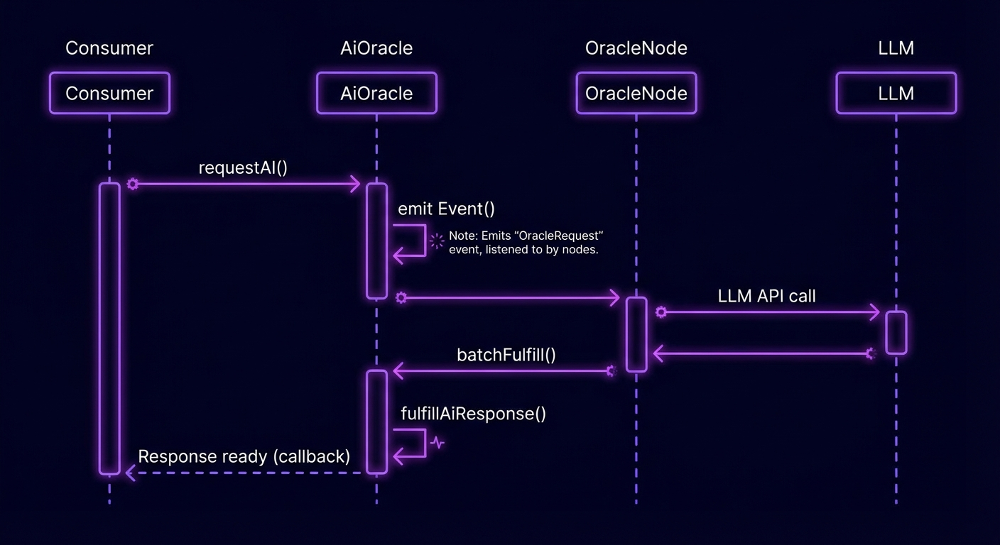

# AI-Oracle | Intelligence for Monad

AI-Oracle bridges the gap between on-chain smart contracts and off-chain artificial intelligence models. Native to the high-performance Monad blockchain, it allows developers to query LLMs (Large Language Models) and receive responses via a push-based callback mechanism.



## Features

- **⚡ Sub-Second Latency**: Optimized for Monad's 10,000 TPS, delivering responses in the same block whenever possible.
- **🛡️ Trusted High-Performance Oracle**: A secure, authorized node network handles off-chain computation and callbacks, ensuring reliable delivery.
- **🧠 Wide Range of Models**: Access top-tier models like Gemini 3 Pro, GPT-4, and Llama 3 directly on-chain.
- **🔥 Deflationary Tokenomics**: Fees paid in **$AI** are **100% burned**, creating a direct link between network usage and token scarcity.

## Architecture

1. **Request**: Consumer contract calls `ask()` and pays $AI fee.
2. **Event**: AiOracle emits `RequestAiResponse`.
3. **Process**: Off-chain nodes listen, query the LLM (e.g., Gemini), and sign the result.
4. **Callback**: Oracle calls `fulfillAiResponse()` on your contract with the data.

## Quick Start

### 1. Install SDK

```bash
npm install @ai-oracle/sdk
```

### 2. Implement Consumer Contract

Inherit from `AiOracleConsumer` to unlock AI capabilities.

```solidity
// SPDX-License-Identifier: MIT
pragma solidity ^0.8.20;

import "@ai-oracle/sdk/contracts/AiOracleConsumer.sol";

contract MyDapp is AiOracleConsumer {
    
    constructor(address _oracle) AiOracleConsumer(_oracle) {}

    function requestAnalysis(string memory prompt) external {
        // Request response decoding into: (string, uint256)
        _askAi("google/gemini-3-pro-preview", prompt, "string, uint256");
    }

    // Callback function
    function fulfillAiResponse(uint256 requestId, bytes calldata data) external override onlyOracle {
        (string memory summary, uint256 score) = abi.decode(data, (string, uint256));
        // Handle your logic here...
    }
}
```

## Contract Addresses (Monad Testnet)

| Contract | Address |
|----------|---------|
| **AI Oracle V1** | `0x7f...3a9` |
| **$AI Token** | `0x2b...c91` |

## Pricing

| Model | Cost per Request ($AI) | Description |
|-------|------------------------|-------------|
| `google/gemini-3-pro-preview` | **1.0 AI** | High-performance reasoning and code generation. |
| `openai/gpt-4o` | **2.5 AI** | Flagship model for complex multi-step tasks. |
| `meta/llama-3-70b-instruct` | **0.5 AI** | Efficient open-source model for general tasks. |

---

## Development (Website)

This repository also contains the landing page and documentation site built with Nuxt.

### Setup

```bash
# Install dependencies
npm install

# Start development server
npm run dev
```